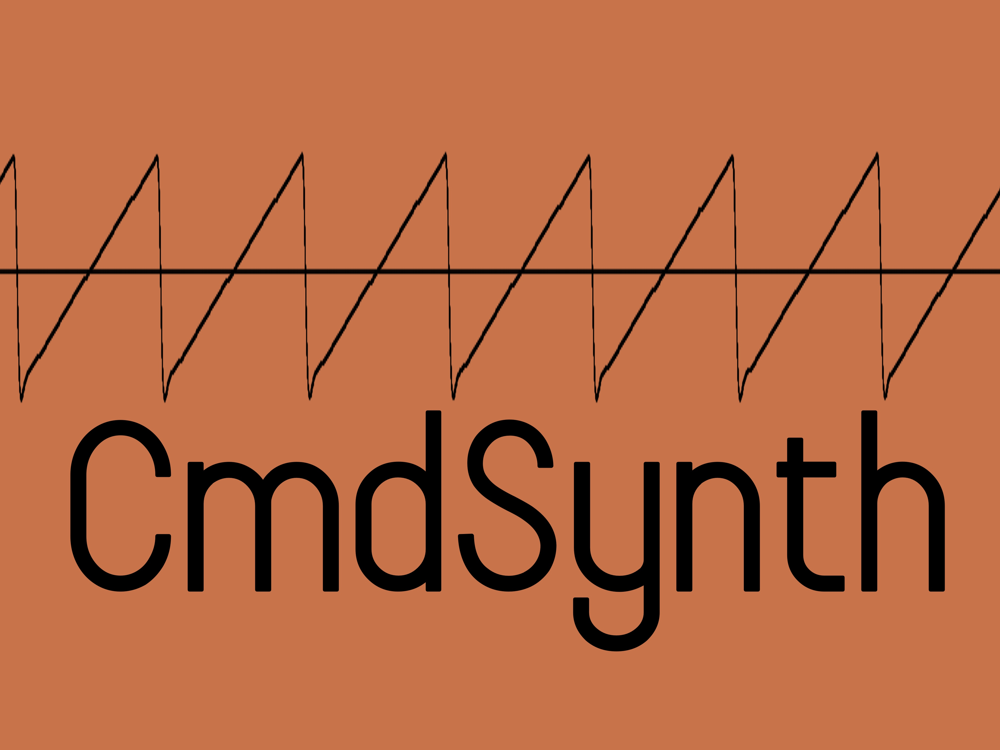

**CmdSynth**
========

CmdSynth is a command-line synthesizer built to generate tones 
based on user input. It supports all four basic wavetypes (sine, 
square, sawtooth, and triangle) and it currently only supports 
outputs in the format of .wav files. CmdSynth also comes with a
built-in sequencer mode where a text file containing the sequence
data can be read and synthesized into a single .wav file.

**Installation**
------------
Download the project files from the GitHub repository:
```
git clone https://github.com/AndrewLockett03/cmdsynth.git
```

Navigate to the project directory, then:
```
make
```

This is meant to work on linux and macOS systems with g++

**Usage**
------------
CmdSynth supports two current modes: single note generation
and sequencer mode.

It can be used as a command line tool as described below, or can be 
used as a library and run via a custom script.

**Single Note Generation**
------------

To generate a single note, use the following command:
```
./cmdsynth <sample_rate> <waveform_type> <cutoff> <note_name> <duration>
```
For example, to generate a 440 Hz sine wave for 2 seconds at a sample 
rate of 44100 Hz with a cutoff frequency of 16000 Hz, you would run:
```
./cmdsynth 44100 1 16000 A4 2
```
Where the waveform types are defined as:
1 - Sine Wave
2 - Square Wave
3 - Sawtooth Wave
4 - Triangle Wave

Output is saved as: `recording.wav` in ./data directory.

**Sequencer Mode**
------------

To use the sequencer mode, create a text file with the following format:
```
<note_name> <duration>
<note_name> <duration>
<note_name> <duration>
...
```

note_name should be in the format of `A4`, `C#5`, `Db2` etc.,
or to generate silence, put `S` as the note name.

Duration is measured in seconds.

For example, a simple C major scale with rest in between notes could be 
represented as:
```
C3 0.5
S 0.5
D3 0.5
S 0.5
E3 0.5
S 0.5
F3 0.5
S 0.5
G3 0.5
S 0.5
A3 0.5
S 0.5
B3 0.5
S 0.5
C4 0.5
```

To generate the audio based on a sequence file, use the following command:
```
./cmdsynth <sample_rate> <waveform_type> <cutoff> <input_file>
```
For example:
```
./cmdsynth 44100 3 12000 test_sequence.txt
```

Output is saved as: `recording.wav` in ./data directory.

**Dependencies**
------------

CmdSynth relies on standard C++ libraries and does not require any external 
downloads. Its wav file handling is done through dr_wav (https://github.com/mackron/dr_libs) 
by David Reid. This is a one-file library included in the project that simplifies 
reading and writing to wav files.

**Future Improvements**
------------

- Add support for ADSR envelopes
- Implement realtime playback
- Add support for midi file ingestion
- Add independent gain to each note in sequencer mode
